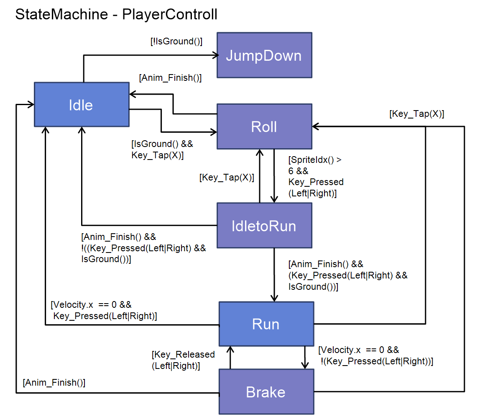

### 작업 내용
---

####  StateMachine을 이용한 Player 조작 Animation 전환 적용
- State의 Enter에서 FlipbookPlayer의 Animation을 전환하도록 적용

##### StateMachine Diagram
- 파랑은 Animation Repeat(True), 보라는 Repeat(false)

>[!tip]
>플레이어의 상태 전환은 Script와 State의 FinalTick() 에서 조건으로 처리하였음

#### Test Level을 생성하여 배경 오브젝트 일부 배치 완료

