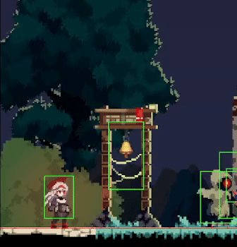

### 작업 내용
---

#### WavePostProcess 추가
-  ShaderToy 사이트에서 적당한 Wave작성 함수를 약간만 변형하여 적용하였음.
-  상호작용이 일어나면, 그 시점부터 Wave 효과가 적용 될 수 있도록 개별적인 물체의 생성시간을 알 수 있도록 Transform 구조체에 넣어주었음.

#### 구르기로 몸체 Collider On/Off 기능 추가
- 플레이어의 몸체는 몬스터와 Collider Check가 발생하면 뚫지 못하지만, 구르기를 시전하면서 몸체의 Collider를 끄고 키면, 넘어갈 수 있음과 동시에 무적판정까지도 채용할 수 있으므로 구르기 State의 Enter에 DeActive, Exit에 Active를 넣어주었다.

