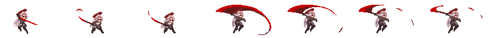
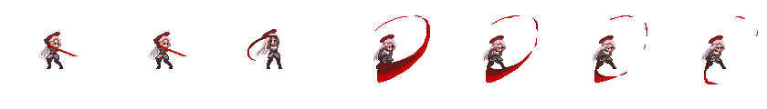
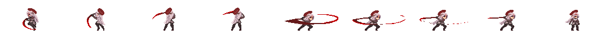

### 작업 내용
---

#### 플레이어 공격 모션 Animation 교체작업 완료

#### Engine 개선작업 *Prefab Clone() 수정*

>[!bug]
>Prefab 생성시의 Clone() 함수를 수정하였음. 기존에는 부모 오브젝트의 Layer를 선택하면 하위 자식들은 부모의 Layer를 따라가지 않고 부모의 Layer를 무조건적으로 따라갔음. Prefab 에 map으로 자신의 LayerIdx 를 저장하고 로드하도록 수정하였음.

#### 피격 시 이펙트 개선

>[!bug]
>피격 시 이펙트가 발생할 때 다른 오브젝트여도 같은 Flipbook을 사용하고 있다면, 전체적으로 피격 이펙트가 출력되는 문제가 발생하였음, 관리 주체를 각 FlipbookPlayer Component로 변경하여 해결함.

