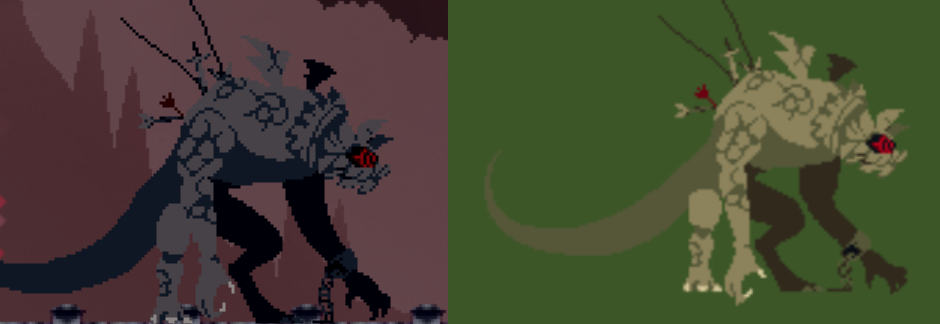

### 작업 내용
---

#### 추출 에셋 전용 쉐이더 제작
- 보스와 기타 다른 몬스터등의 파일들은 뒷배경이 초록색이기에 (RGB 60,86,39) PS_Shader 상에서 그부분은 discard 처리하도록 따로 쉐이더를 제작하였음. 현재는 보스만 사용하고 있고, 보스 색상도 원본 게임과 비슷하게 좀더 어두운 색으로 변경처리 하였음.

-> 쉐이더 적용과 적용 전 원본 텍스쳐

#### Monster2 제작 완료
*(Monster2 테스트 영상 - GitHub에서는 동영상 미지원)*
-> 시야 범위에 들어오면 몸으로 들이받는 공격을 시도한다.

#### 몬스터 사망시 카메라 흔들림 Effect 추가
- 카메라 스크립트에 흔들림 관련 변수들을 추가하여 제작하였음.

