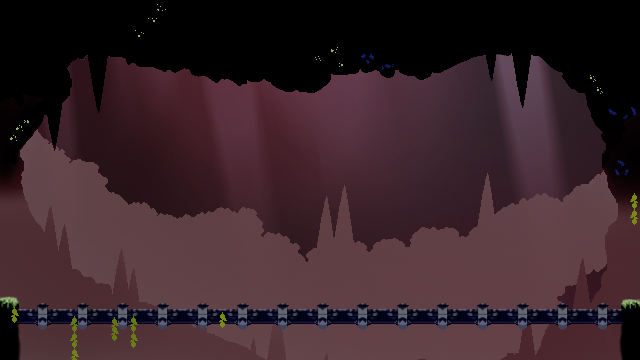

### 작업 내용
---

#### 호수 물보라 이펙트 적용
- 호수에 Collider를 적용해서 Script를 추가하였음. Begin과 End가 호출되면 자식으로 설정해둔 이펙트 오브젝트의 Flipbook을 재생하도록 하였음.
- 잔상이 남는 경우가 발생하여, 처음과 끝부분에 빈 Sprite를 설정하였음.

>[!note]
>장점 : 플레이어 뿐만아니라 모든 몬스터에도 상호작용이 됨
>
>단점 : 이펙트 자체가 물에 들어가는것과 나오는것 하나씩만 자식으로 설정되어있기에, 몬스터와 플레이어 동시에 수면에 효과를 띄울수는 없었음.

#### 보스 몬스터 레밸 배경 작업

-> 시간관계상 ClipStudio 프로그램을 이용해서 최대한 원본과 비슷하게 짜집기를 통해서 Texture 한장으로 퉁쳤다.

